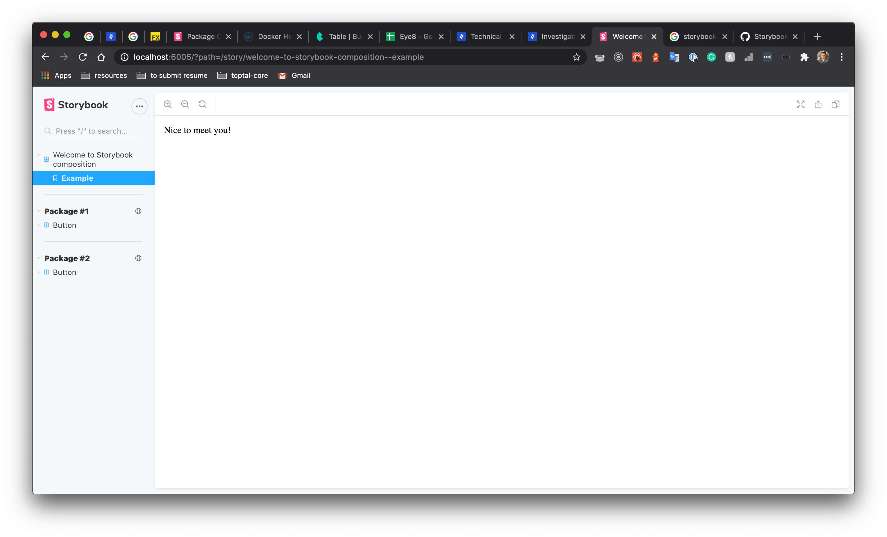

# Using composition  

Composition is the ability to reference external Storybooks inside your own Storybook. It can be achieved by creating a main.js file inside <projectRoot>/.storybook folder with the following content:

```js
// .storybook/main.js

module.exports={
  // your Storybook configuration
  refs: {
   'design-system': {
     title: "Storybook Design System",
     url: "https://5ccbc373887ca40020446347-yldsqjoxzb.chromatic.com"
   }
  }
}
```

When Storybook is loaded in the browser it combines all the stories and stacks the Canvases on top of each other in the UI.

When you click on an external story, Storybook swaps in the external Canvas for that story. All of this happens behind the scenes; you have a seamless experience whether you’re interacting with a local or external story.

To implement it locally we need to have a bin that starts storybooks for every package and then start the one composing all of them.

## Pros:
- Full independence of every storybook.
- Composition does not touch code, webpack, or any project-specific configuration.
- Pretty fast as the only one storybook is loaded at a time.

## Cons:
- Each package’s storybook requires support.
- The more packages we have, the more difficult ports' management will be.
- May cause high load locally because of many storybooks running at the same time.

## Screenshots

### When all the packages are available



### When a package is unavailable


